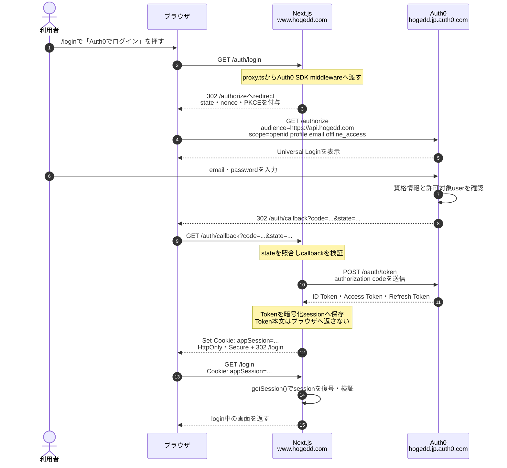
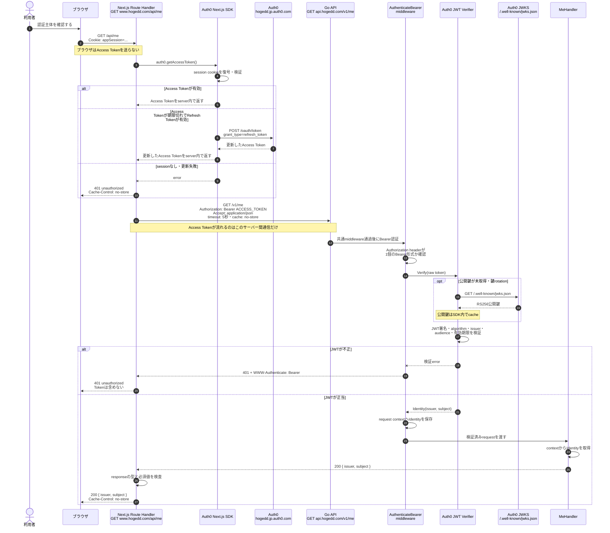
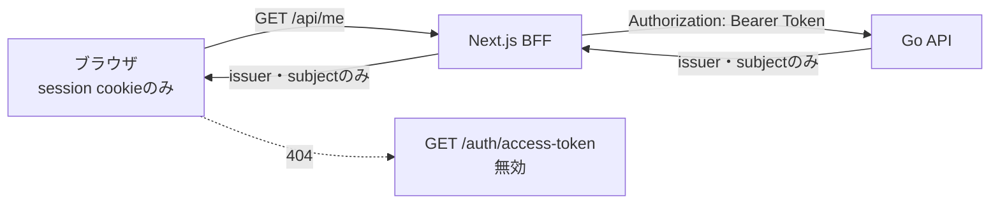

# 認証BFFの通信フロー

HogeDD Webは、ブラウザへAuth0 Access Tokenを渡さないBFF（Backend for Frontend）構成を採用しています。

ブラウザが呼ぶHogeDD側のendpointは`https://www.hogedd.com/api/me`です。Next.jsサーバーがsessionからAccess Tokenを取り出し、`https://api.hogedd.com/v1/me`を代理で呼び出します。

## 登場するendpoint

| endpoint                                                | 呼び出し元                      | 役割                                                                 |
| ------------------------------------------------------- | ------------------------------- | -------------------------------------------------------------------- |
| `GET https://www.hogedd.com/login`                      | ブラウザ                        | login状態を表示する画面                                              |
| `GET https://www.hogedd.com/auth/login`                 | ブラウザ                        | Auth0 Universal Loginを開始するAuth0 SDKのroute                      |
| `GET https://hogedd.jp.auth0.com/authorize`             | Next.js / ブラウザ              | Auth0で認証・認可を行う                                              |
| `GET https://www.hogedd.com/auth/callback`              | Auth0からredirectされたブラウザ | authorization codeをNext.jsへ渡すAuth0 SDKのcallback route           |
| `POST https://hogedd.jp.auth0.com/oauth/token`          | Next.jsサーバー                 | authorization codeまたはrefresh tokenをTokenへ交換するサーバー間通信 |
| `GET https://www.hogedd.com/api/me`                     | ブラウザ                        | 現在の利用者を取得するHogeDD WebのBFF endpoint                       |
| `GET https://api.hogedd.com/v1/me`                      | Next.jsサーバー                 | Bearer Tokenを検証し、認証主体を返すGo API                           |
| `GET https://hogedd.jp.auth0.com/.well-known/jwks.json` | Go API                          | JWTの署名検証に使う公開鍵を取得する。取得後はcacheされる             |
| `GET https://www.hogedd.com/auth/access-token`          | 呼び出し不可                    | Access Tokenをブラウザへ公開しないため`404`にしている                |

## 1. Loginとsession作成

最初に、Auth0でのlogin結果をNext.jsの暗号化session cookieへ保存します。この段階ではGo APIを呼びません。

重要なのは、ブラウザが保持するのは`HttpOnly`のsession cookieであり、Access Tokenそのものではない点です。`HttpOnly` cookieはブラウザのJavaScriptから読み取れません。

## 2. BFFから認証済みGo APIを呼ぶ

login後にブラウザが`GET /api/me`を呼ぶと、Next.jsだけがAccess Tokenを扱い、Go APIへBearer Tokenとして送ります。

## Endpointごとの責務

### `GET www.hogedd.com/api/me`

Next.js側のHTTP境界です。

1. Auth0 sessionからAccess Tokenを取得する。
2. `HOGEDD_API_BASE_URL`を基準に`GET /v1/me`を呼ぶ。
3. Go APIのresponseが`issuer`と`subject`を持つか検査する。
4. ブラウザへ認証主体だけを返し、Access Tokenは返さない。
5. 全responseへ`Cache-Control: no-store`を設定する。

実装は`app/api/me/route.ts`、Go API clientは`app/_lib/hogedd-api.ts`です。

### `GET api.hogedd.com/v1/me`

Go API側の認証済みendpointです。

1. 共通middlewareでrequest ID、security header、access log、panic recoveryを適用する。
2. endpoint固有の`AuthenticateBearer` middlewareでBearer形式を確認する。
3. Auth0 JWKSを使い、JWTの署名、RS256、issuer、audience、有効期限を検証する。
4. 検証済み`Identity`をGoのrequest contextへ保存する。
5. `MeHandler`がcontextから`issuer`と`subject`だけを取り出して返す。

このendpointはAccess Token内のemailを返しません。現在の`subject`は将来DBのuserと紐づけるための認証主体識別子です。

## Status codeの変換

| 状況                         | Go API               | Next.js BFF         | ブラウザが受け取る結果                  |
| ---------------------------- | -------------------- | ------------------- | --------------------------------------- |
| 正常                         | `200`                | bodyを検査して`200` | `{ "issuer": "...", "subject": "..." }` |
| sessionがない・Token取得失敗 | 呼ばない             | `401`               | `unauthorized`                          |
| Bearer Tokenが不正・期限切れ | `401`                | `401`へ変換         | `unauthorized`                          |
| Go APIが`401`以外のerror     | `4xx`または`5xx`     | `502`へ変換         | `upstream_unavailable`                  |
| Go APIが5秒以内に応答しない  | 到達不能または処理中 | `502`へ変換         | `upstream_unavailable`                  |
| Go APIの成功bodyが想定外     | `200`                | `502`へ変換         | `upstream_unavailable`                  |
| Auth0またはAPI環境変数が不足 | 呼ばない             | `503`               | `service_unavailable`                   |

内部errorやTokenをそのまま返さず、ブラウザ向けの固定されたerrorへ変換します。

## Access Tokenがブラウザへ出ない境界

- Access TokenをClient Componentのpropsやstateへ渡さない。
- Access TokenをJSON responseへ含めない。
- Access TokenをLocal Storage、Session Storage、通常のJavaScript変数へ保存しない。
- `enableAccessTokenEndpoint: false`により`GET /auth/access-token`を公開しない。
- BFFとGo APIのresponseをcacheしない。
- server logへAuthorization headerやTokenを出力しない。
